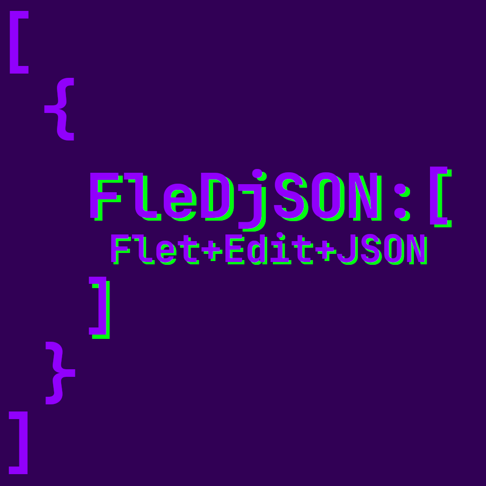

# FleDjSON

<div align="center">
	
</div>

FleDjSONは、JSONデータを視覚的に編集・操作できる汎用GUIエディタアプリケーションです。ツリー表示によるデータ閲覧と、直感的なフォームインターフェースによる編集をサポートしています。

[](https://www.python.org/)
[](https://flet.dev/)
[](LICENSE.md)
[](https://github.com/yok-tottii/FleDjSON)

## 特徴と機能

- **JSONデータの視覚化**: 複雑なJSON構造をツリー形式で表示し、データ関係を把握しやすくします
- **自動構造解析**: JSONデータを読み込み、構造を自動的に解析して最適な表示を行います
- **インタラクティブな編集**: 選択したノードの内容をフォームで編集できます
- **ドラッグ＆ドロップ**: ノードの移動や再編成を直感的に行えます
- **高度な検索機能**: データ内の特定要素をすばやく見つけられます
- **ネスト構造対応**: 複雑にネストされたJSON構造も適切に処理します
- **汎用データ処理**: 特定のデータ構造に依存せず、様々なJSON形式に対応できます
- **テーマ切り替え**: システム/ライト/ダーク/FleDjSONテーマに対応
- **多言語対応**: 日本語/英語の切り替えに対応
- **テンプレート機能**: JSONテンプレートの生成と適用
- **フラット化機能**: ネスト構造の平坦化と展開
- **エラー回復機能**: 破損データの自動修復機能

### 制限事項

> **注意**: FleDjSONは汎用的なJSONエディタを目指していますが、すべてのJSON構造を完全に解析・視覚化できるわけではありません。特に以下のような構造では制限があります：
>
> - 極めて深いネスト構造（数百階層以上）
> - 非常に大きなファイル（数百MB以上）
> - 特殊な循環参照を含む構造
> - 一部の複雑な混合配列構造
>
> これらの場合、部分的な表示や編集制限が発生する可能性があります。

## システム要件

- Python 3.12系
  - 3.13以上は未検証です
- Poetry
- 依存パッケージ:
  - flet[all]
  - pyinstaller (ビルド用、オプション)

## インストールと実行

### Poetry を使用する場合

```bash
# リポジトリをクローン
git clone https://github.com/yok-tottii/FleDjSON.git
cd FleDjSON

# 依存関係をインストール
poetry install

# アプリケーションを実行
poetry run flet run src/main.py
```

### Pip を使用する場合

> **注記**: このプロジェクトはPoetryで依存関係を管理しているため、requirements.txtは含まれていません。以下の方法でインストールできます。

```bash
# リポジトリをクローン
git clone https://github.com/yok-tottii/FleDjSON.git
cd FleDjSON

# Poetryから依存関係をエクスポートしてインストール
poetry export -f requirements.txt --output requirements.txt --without-hashes
pip install -r requirements.txt

# または、pyproject.tomlから直接インストール
pip install flet[all]>=0.28.2

# アプリケーションを実行
flet run src/main.py
```

## 使い方

1. アプリケーションを起動します
2. 「JSONファイルを選択」ボタンをクリックし、編集したいJSONファイルを開きます
3. 左側のツリービューでノードを選択します
4. 右側のフォームでデータを編集します
5. 編集が完了したら「名前を付けて保存」ボタンでファイルを保存します

### キーボードショートカット

- **Ctrl+S / Cmd+S**: 現在のデータを保存します
- **Ctrl+Shift+S / Cmd+Shift+S**: 名前を付けて保存

## アーキテクチャ概要

FleDjSONは、マネージャーベースのアーキテクチャを採用しています。13個の専門マネージャークラスに機能が分割されており、それぞれが特定の責務を担当しています：

### コアマネージャー

- **DataManager**: データの読み込み、操作、保存を担当
- **UIManager**: ツリービューやUIレンダリングを担当
- **AnalysisManager**: JSONデータの解析と構造分析を担当
- **FormManager**: フォーム生成・編集バッファ管理を担当
- **UIStateManager**: UIの状態管理を担当

### 機能マネージャー

- **SearchManager**: 検索機能とインデックス管理を担当
- **DragDropManager**: ドラッグ＆ドロップ操作を担当
- **SettingsManager**: アプリケーション設定の永続化を担当
- **TemplateManager**: JSONテンプレート生成を担当
- **CopyManager**: 安全なデータコピー機能を担当
- **FlattenManager**: JSON構造の平坦化を担当

### サポートシステム

- **EventHub**: 57種類のイベント型による非同期通信
- **NotificationSystem**: macOS対応の代替通知システム
- **FeedbackManager**: 進捗表示とユーザーフィードバック
- **ErrorHandler**: 統合エラー処理と回復機能
- **LoggingConfig**: DEBUG_MODE連動の統合ログシステム

このような設計により、コードの保守性と拡張性の向上を図っています。また、新機能の追加やバグ修正が特定のコンポーネントに集中することで、アプリケーション全体の安定性が高まることが期待されます。

### データフロー

1. **読み込み**: JSONファイルからデータを読み込み
2. **解析**: データ構造を分析し、特性を把握
3. **視覚化**: ツリービューとして表示
4. **対話**: ユーザーによる選択・編集
5. **検証**: 変更データの妥当性確認
6. **保存**: 編集済みデータの保存

### JSONフラット化アルゴリズム

本アプリケーションは、様々な形式のJSONデータに対応するために独自のフラット化アルゴリズムを実装しています。このアルゴリズムにより、複雑にネストされたオブジェクト構造を、アプリケーションが内部で扱いやすい配列形式に変換します。

これによって、特定のデータ構造に依存せず、多様なJSONファイルを処理できるという利点があります。ただし、前述の制限事項にあるような極端に複雑な構造では、完全な変換ができない場合があります。

## テストと開発

### テストの実行

```bash
# すべてのテストを実行
poetry run pytest

# カバレッジレポート付きでテストを実行
poetry run pytest --cov=src
```

## ビルド方法

### デスクトップアプリとしてビルド

```bash
# Fletのビルドコマンドを使用
poetry run flet build macos  # macOS用
poetry run flet build windows  # Windows用
poetry run flet build linux  # Linux用(未検証)
```

### Windows向けの追加オプション（PyInstaller）

Windows環境では、Fletビルドの他にPyInstallerを使用したビルド方法も提供しています。
PyInstallerの方がより安定して動作する場合があります。

```bash
# PyInstallerを使用したビルド（推奨）
poetry run python win-pyinstaller-build.py

# オプション: Fletビルドメソッドを使用
poetry run python win-pyinstaller-build.py --method flet

# オプション: シンプルなPyInstallerビルド
poetry run python win-pyinstaller-build.py --method simple
```

PyInstallerビルドの利点：

- より安定した動作
- 単一の実行ファイル（.exe）を生成
- Windows環境での互換性が高い
- 詳細なビルド設定が可能

#### Windows環境へのファイル転送

macOS/Linux環境からWindows環境へファイルを転送する際は、以下のスクリプトを使用できます：

```bash
# Windows用のビルドパッケージを作成
./create-windows-build-package.sh
```

これにより、必要なすべてのファイルを含むZIPファイルが作成されます。

### モバイルアプリとしてビルド（未検証）

> **注意**: モバイルアプリとしての動作は検証されていません。以下は参考情報です。

```bash
# Androidアプリとしてビルド
poetry run flet build apk

# iOSアプリとしてビルド
poetry run flet build ipa
```

### Webアプリとしてビルド（未検証）

> **注意**: Webアプリとしての動作は検証されていません。以下は参考情報です。

```bash
# Webアプリとして実行
poetry run flet run --web
```

ビルドの詳細については[Flet公式ドキュメント](https://flet.dev/docs/guides/python/packaging-desktop-app)を参照してください。

## プロジェクト構造

```text
FleDjSON/
├── src/                        # メインソースコード（18,786行）
│   ├── __init__.py
│   ├── app.py                  # アプリケーションクラス
│   ├── main.py                 # エントリーポイント
│   ├── assets/                 # アプリケーションリソース
│   │   ├── icon.png            # アプリケーションアイコン
│   │   └── icon_windows.ico    # Windows用アイコン
│   ├── managers/               # 13個のマネージャークラス
│   │   ├── __init__.py
│   │   ├── analysis_manager.py # JSON構造分析
│   │   ├── copy_manager.py     # 安全なコピー機能
│   │   ├── data_manager.py     # データ管理
│   │   ├── drag_drop_manager.py # ドラッグ&ドロップ
│   │   ├── event_aware_manager.py # イベント対応基底クラス
│   │   ├── flatten_manager.py  # JSON平坦化
│   │   ├── form_manager.py     # フォーム管理
│   │   ├── search_manager.py   # 検索機能
│   │   ├── settings_manager.py # 設定管理
│   │   ├── template_manager.py # テンプレート管理
│   │   ├── ui_manager.py       # UI管理
│   │   └── ui_state_manager.py # UI状態管理
│   ├── storage/                # データ保存領域
│   │   └── data/
│   │       └── settings.json   # アプリケーション設定
│   ├── notification_system.py  # 代替通知システム
│   ├── event_hub.py            # イベント通知システム
│   ├── event_integration.py    # イベント統合
│   ├── error_handling.py       # エラー処理
│   ├── feedback.py             # フィードバックシステム
│   ├── flatten_json.py         # JSONフラット化
│   ├── json_template.py        # テンプレート機能
│   ├── optimizations.py        # パフォーマンス最適化
│   ├── debug_control.py        # デバッグ制御
│   └── logging_config.py       # ログ設定
├── tests/                      # テストコード（20+ファイル）
│   ├── __init__.py
│   ├── conftest.py
│   ├── test_*.py               # 各種テストファイル
│   └── mock_*.py               # モックファイル
├── scripts/                    # 開発・テストスクリプト
├── docs/                       # ドキュメント
│   ├── examples/               # サンプルJSONファイル
│   └── genericity_verification.md
├── pyproject.toml             # プロジェクト設定
├── poetry.lock                # 依存関係ロック
├── pytest.ini                 # pytest設定
└── README.md                  # このファイル
```

## ライセンス

このプロジェクトはMITライセンスの下で提供されています。詳細は[LICENSE.md](LICENSE.md)ファイルをご覧ください。

### 免責事項

**このソフトウェアは全て自己責任で利用してください。**

このソフトウェアは「現状のまま」提供され、明示または黙示を問わず、商品性、特定目的への適合性、および非侵害の保証を含むがこれに限定されない、いかなる種類の保証もなく提供されます。いかなる場合においても、作者または著作権所有者は、契約行為、不法行為、またはその他の行為によるものであるかどうかにかかわらず、ソフトウェアまたはソフトウェアの使用またはその他の取引から生じる、または関連する、いかなる請求、損害、またはその他の責任に対しても責任を負いません。

データの損失や破損が生じる可能性があるため、重要なデータは必ずバックアップを取った上でご利用ください。

## 開発時の注意事項

### 除外すべきファイル

以下のファイル/フォルダーはバージョン管理から除外してください：

- `build/` - ビルド時の一時ファイル
- `dist/` - ビルド成果物
- `*.spec` - PyInstallerの設定ファイル
- `FleDjSON-windows-build-*.zip` - ビルドパッケージ

## 環境変数

FleDjSONは以下の環境変数をサポートしています：

- **DEBUG_MODE**: デバッグレベルを制御（0=本番、1=通常デバッグ、2=詳細デバッグ）

  ```bash
  # 本番モード（初期化メッセージ非表示、WARNING以上のログ）
  DEBUG_MODE=0 poetry run flet run src/main.py
  
  # 通常デバッグ（初期化メッセージ表示、INFO以上のログ）
  DEBUG_MODE=1 poetry run flet run src/main.py
  
  # 詳細デバッグ（すべてのデバッグ情報表示）
  DEBUG_MODE=2 poetry run flet run src/main.py
  ```

## 謝辞

このプロジェクトは[Flet](https://flet.dev/)フレームワークを利用しています。

### 開発ツール

**このアプリケーションはほぼ100% [Claude Code](https://github.com/anthropics/claude-code)を使用して開発されました。**

Claude Codeは、Anthropic社が提供するAIペアプログラミングツールで、このプロジェクトの設計、実装、テスト、ドキュメント作成のすべての段階で活用されました。約18,786行のコードと包括的なテストスイートは、Claude Codeとの協働により効率的に構築されました。

### コントリビューター

- メイン開発者: [yok-totti](https://github.com/yok-tottii)
- AI開発パートナー: Claude Code (Anthropic)
